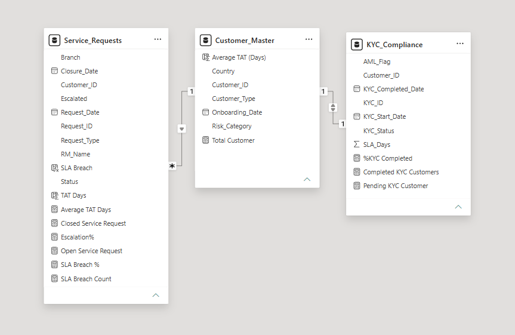

# Banking Operations-Compliance Dashboard
### Project Overview
This Power BI dashboard provides an end-to-end view of bankimg operations and regulatory compliance using a synthetic data based on Indian banking operations.
The dasboard enables monitoring of:
1. Customer Onboarding
2. AML exposure
3. SLA adherence
4. Service request performance
5. Branch operations
6. Relationship Manager performance
## Dasboard Preview
### Dataset
#### The project consists of three datasets:
1. Customer_Master
2. KYC_Compliance
3. Service_Requests

#### Total Records
1. Customers:300
2. KYC Record:300
3. Service Requests:500
### Dashboard Features
1. Customer Segmentation
2. KYC Compliance Monitoring
3. AML Exposure Analysis
4. SLA Breach Monitoring
5. Service Request Analysis
6. Branch Performance
7. Relationship Manager Performance
8. Interactive Slicers
### Key performance Indicators
1. Total Customers
2. KYC Completion %
3. Pending KYC
4. Customer Type
5. Average TAT
6. SLA Breach %
## Dashboard Visuals
1. KYC Compliance Status
2. Customer Segment Distribution
3. Customer Risk Profile
4. AML Exposure Across Risk Segments
5. KYC Compliance by Risk Category
6. Service Request Status Overview
7. Branch Volume
8. Average TAT by Request Type
9. RM Escalation Performance
### Tools & Technologies
1. Microsoft Power BI
2. DAX
3. Power Query
4. CSV
5. Data Modelling
### Data Model

### Key Insights
1. 74.33% customers completed KYC
2. Retail customers constitute nearly 70% of the customer base
3. High-risk customers represent approximately 18% of the portfolio
4. Bangalore branch handled the highest request volume
5. Address change requests recorded the highest average TAT
6. SLA breach rate indicates opportunities for operational improvement
### Future Improvements
1. Live SQL database integration
2. Incremental refresh
3. Automated email reporting
4. Real-time KPI monitoring

### How to Use
1. Repository
**GitHub Repository:**  
<https://github.com/AnjaniRaman/PowerBI-Banking-Operations-Compliance_Dashboard>

[![Banking Operations Dashboard][Banking operations & Compliance Dashboard.png]

3. Download or clone the project files to your local machine.
4. Open **Bank.pbix** using Power BI Desktop.
5. Explore the interactive dashboard using the available slicers to analyze KYC compliance, AML monitoring, service requests, and SLA performance.
6. Refer to the README for details about the dataset, data model, DAX measures, and key business insights.

### Project Notes
1. This project uses a synthetic banking dataset created for learning and portfolio purposes.
2. The dashboard is built using Power BI with DAX measures and a relational data model.
3. The analysis focuses on KYC compliance, AML monitoring, service request management, and SLA performance.
4. Relationships between tables are established using the `Customer_ID` field.

### Dataset Limitations
1. This project uses synthetic data and does not contain real customer or banking information.
2. Each customer has a single KYC record; historical KYC renewals are not included.
3. The dashboard is intended to demonstrate Power BI data modeling, DAX calculations, and business reporting techniques.
